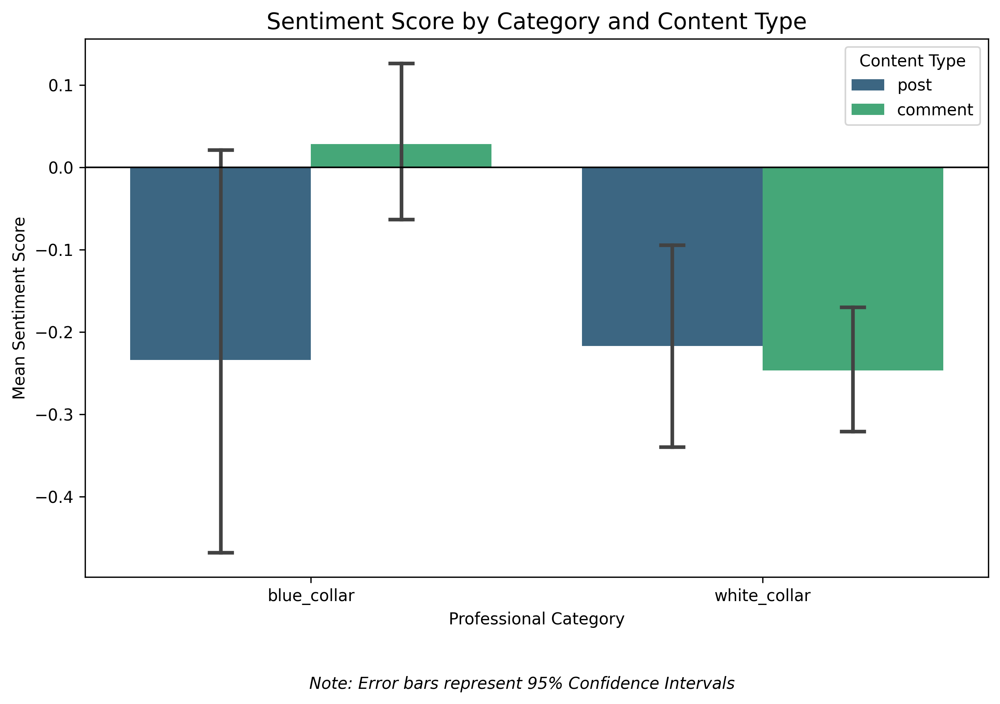

# Supplementary Materials

**Manuscript:** Computational Based Comparison of COVID-19 Vaccine Sentiment Between Occupational Groups on Reddit in 2021

---

## S1. Additional Figures

### Figure S1: Interaction of Content Type and Profession Category on Sentiment

This figure illustrates how sentiment differed between original posts and comments across the two occupational categories. While posts were consistently negative in both groups, blue-collar comments trended positive while white-collar comments remained negative.



---

### Figure S2: Monthly Sentiment Trends: Blue vs. White Collar (2021)

Longitudinal analysis of monthly mean sentiment scores throughout 2021. The blue-collar cohort showed high volatility with several positive peaks, while the white-collar cohort remained predominantly negative throughout the observation period.


---

## S2. Complete Subreddit Statistics

**Table S1: Detailed Sentiment Statistics by Subreddit**

| Category | Subreddit | N | Mean Sentiment | Std Dev | 95% CI Lower | 95% CI Upper |
|----------|-----------|---|----------------|---------|--------------|--------------|
| blue_collar | KitchenConfidential | 190 | 0.1632 | 0.9083 | 0.0332 | 0.2931 |
| blue_collar | Firefighting | 62 | -0.0806 | 0.8926 | -0.3073 | 0.1460 |
| blue_collar | ProtectAndServe | 42 | -0.1667 | 0.8239 | -0.4234 | 0.0901 |
| blue_collar | Machinists | 38 | -0.5526 | 0.6857 | -0.7780 | -0.3273 |
| blue_collar | Construction | 11 | 0.1818 | 0.9816 | -0.4777 | 0.8413 |
| blue_collar | electricians | 10 | -0.1000 | 0.8756 | -0.7264 | 0.5264 |
| blue_collar | Plumbing | 6 | 0.0000 | 0.8944 | -0.9386 | 0.9386 |
| blue_collar | Truckers | 2 | -0.5000 | 0.7071 | -6.8531 | 5.8531 |
| blue_collar | Carpentry | 1 | 1.0000 | NaN | NaN | NaN |
| blue_collar | Welding | 1 | -1.0000 | NaN | NaN | NaN |
| white_collar | law | 199 | -0.3065 | 0.7258 | -0.4080 | -0.2051 |
| white_collar | Accounting | 146 | -0.2740 | 0.8181 | -0.4078 | -0.1402 |
| white_collar | consulting | 71 | -0.1268 | 0.6531 | -0.2814 | 0.0278 |
| white_collar | cscareerquestions | 58 | -0.0517 | 0.7819 | -0.2573 | 0.1539 |
| white_collar | engineering | 2 | 0.0000 | 0.0000 | NaN | NaN |

*Note: For subreddits with N ≤ 2, confidence intervals may be unreliable or not applicable.*

---

## S3. LLM Classification Prompt

The following prompt was used for sentiment classification with Gemini 2.5 Flash:

```
Analyze the sentiment of the following text, determining the text's opinion on COVID vaccinations, as to whether it has a positive sentiment towards COVID vaccines, a negative sentiment towards COVID vaccines, or a neutral sentiment towards COVID vaccines. Return only a single word: 'positive', 'neutral', or 'negative'.

Text: "[text_content]"
```

**Model Parameters:**
- Model: `gemini-2.5-flash`
- Temperature: 0
- Thinking Budget: 0

---

## S4. Data Collection Keywords

The following keywords were used to filter relevant content:

```
["vaccine", "vaccinated", "vaccination", "pfizer", "moderna", "j&j"]
```

---

## S5. Statistical Test Details

**Independent Samples T-Test (Blue Collar vs. White Collar):**
- t-statistic: 3.967
- Degrees of freedom: 837
- p-value: 8.03 × 10⁻⁵
- Effect size (Cohen's d): ~0.27 (small to medium)

**Chi-Square Test of Independence:**
- χ² statistic: 53.82
- Degrees of freedom: 2
- p-value: 2.05 × 10⁻¹²

**Correlation Analysis:**
- Pearson r: 0.023 (p = 0.499)
- Spearman ρ: 0.095 (p = 0.006)
